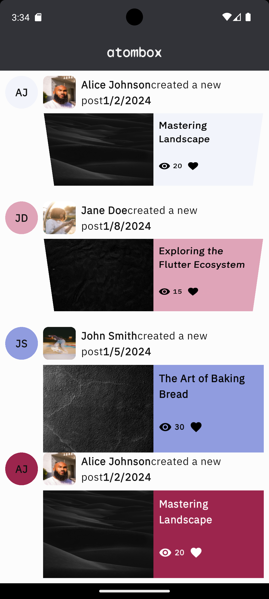
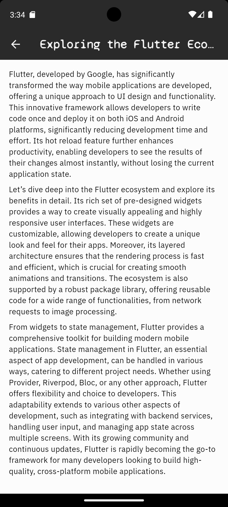

# Blog App Flutter

## Overview

This is a modern Blog App built with Flutter, featuring animated blog cards, smooth transitions, and integrated text-to-speech for accessibility. The app demonstrates advanced UI techniques using animation, color matching, and network image handling. It also supports reading blog content aloud using AI-powered speech.

## Features

- Animated blog post cards with gradient backgrounds and color-matched elements
- Vertical PageView for browsing blogs
- Text-to-speech for selected blog content
- Responsive design and smooth transitions
- Uses Google Fonts, audioplayers, path_provider, and more
- Network image loading with error handling

## Screenshots

| Home Screen | Blog Card Animation | Text-to-Speech |
|:---:|:---:|:---:|
|  |  |  |

> Place your screenshot images in the `screenshots/` folder at the project root. Update the image filenames above as needed.

## Getting Started

1. Clone the repository:
   ```bash
   git clone <your-repo-url>
   cd blog_app_flutter
   ```
2. Install dependencies:
   ```bash
   flutter pub get
   ```
3. Run the app:
   ```bash
   flutter run
   ```

## Dependencies

Add these to your `pubspec.yaml`:

```yaml
google_fonts:
http:
audioplayers:
path_provider:
models:
  path: models
flutter_dotenv:
```

## Project Structure

- `lib/` - Main app code
- `models/` - Blog post data models
- `screens/` - UI screens
- `widget/` - Custom widgets
- `shared/` - Theme and shared resources
- `screenshots/` - App screenshots (add your PNGs here)

## License

MIT License